<div align="center">

# Portfólio <br><br>
 
 <a href="https://web.telegram.org/z/#-1582796052" target='_blank'></a> <a href="https://linkedin.com/in/eduardokaykedasilva" target="blank"></a> <a href="https://web.telegram.org/z/#-1582796052" target="blank"></a> <a href="https://web.telegram.org/z/#-1582796052" target='_blank'></a><br><br>


</div>
Olá, eu sou o Eduardo. Sou Desenvolvedor Full Stack Jr. Esse repositório serve como armazenamento e portfólio para os meus projetos nas mais diversas linguagens e ferramentas. Os projetos estão em ordem de criação, do mais novo para o mais velho. Para que eu consiga comparar meus antigos projetos e ver minha própria evolução.
<br><br>

<div align="center">

<h1> Projetos Até o Momento </h1>

</div>

<div align="center">


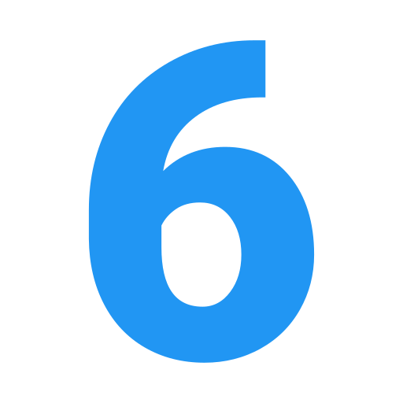

</div>

---

<div>

# Pong

## Sobre o projeto.
Pong é o primeiro videojogo lucrativo da história, dando origem a um novo setor da indústria. Foi de importância fundamental na história do videojogo. Foi criado por Nolan Bushnell e Ted Dabney na forma de um console ligado a um monitor, movido a moedas.<br><br>
Data de conclusão: 10/12/2021<br><br>
## Ferramentas e tecnologias usadas nesse projeto.
 
```js
function Pong(Project) {
    if (Front End) {
        const Stack = `${HTML}, ${CSS}`;
    } 
};
```
<br>

<div align="center">

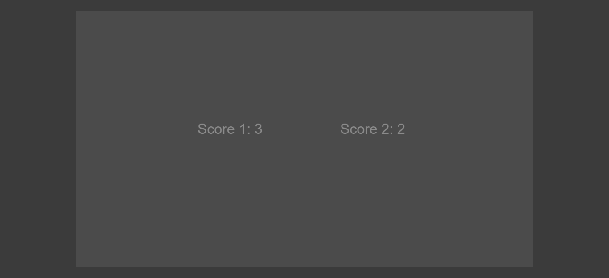

</div>

<br><br>

---

<div>

# Tela de Login e Registro

## Sobre o projeto.
Apresenta duas telas uma cadastro e outra de login. Totalmente responsivo para dispositivos móveis e com campos de checkbox para termos de serviço e recebimento de e-mail marketing.<br><br>
Data de conclusão: 10/12/2021<br><br>
## Ferramentas e tecnologias usadas nesse projeto.
 
```js
function LoginRegister(Project) {
    if (Front End) {
        const Stack = `${HTML}, ${CSS}`;
    } else (Framework) {
        const Stack = `${Bootstrap}`;
    }
};
```
<br>

<div align="center">

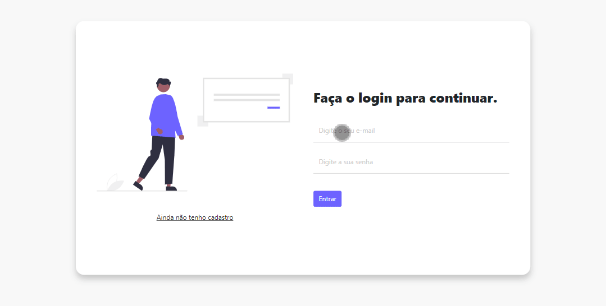

</div>

<br><br>

---

<div>

# Art: Exposição de Artes Urbanas

## Sobre o projeto.
Site responsivo de projetos artísticos. Galeria de grafite. A cidade mais viva e com alegria.<br><br>
Data de conclusão: 30/11/2021<br><br>
## Ferramentas e tecnologias usadas nesse projeto.
 
```js
function ArtUrbana(Project) {
    if (Front End) {
        const Stack = `${HTML}, ${CSS}`;
    } else (Framework) {
        const Stack = `${Bootstrap}`;
    }
};

```
<br>

<div align="center">


</div>

<br><br>

---

<div>

# Botões Refletores

## Sobre o projeto.
Botões coloridos que passam suas cores por clique. Iluminando a página com a cor escolhida de cada botão.<br><br>
Data de conclusão: 25/11/2021<br><br>
## Ferramentas e tecnologias usadas nesse projeto.
 
```js    
function ReflectorButtons(Project) {
    const FrontEnd = `${HTML}, ${CSS}, ${JavaScript}`;
};

``` 
<br>

<div align="center">

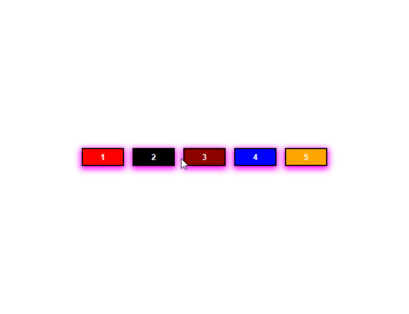

</div>

<br><br>

---

<div>

# Lista de Tarefas

## Sobre o projeto.
Lista de tarefas criada para facilitar a rotina diária. Podendo adicionar e remover suas atividades ao longo do dia. Utilizei o Bootstrap para o estilo da página. As informações são salvas no banco de dados interno do navegador.<br><br>
Data de conclusão: 17/11/2021<br><br>
## Ferramentas e tecnologias usadas nesse projeto.
 
```js    
function ListaDeTarefas(Project) {
    if (Front End) {
        const Stack = `${HTML}, ${CSS}, ${JavaScript}`;
    } else (Framework) {
        const Stack = `${Bootstrap}`;
    }
};

```
<br>

<div align="center">

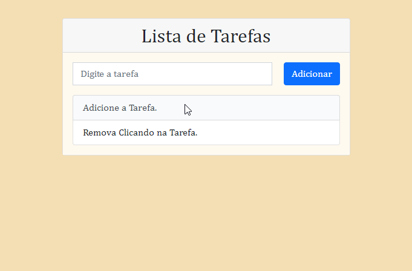

</div>

<br><br>

---

<div>

# Snake

## Sobre o projeto.
Lançado para os fliperamas, o jogo era monocromático e o personagem era movido pelas setas do teclado, porém sua única diferença era sua jogabilidade multiplayer. Seu objetivo também era o mesmo, cada personagem tinha que “comer” o que aparecia na tela e evitar choques contra os muros do cenário.<br><br>
Data de conclusão: 17/11/2021<br><br>
## Ferramentas e tecnologias usadas nesse projeto.
 
```js    
function Snake(Project) {
    const FrontEnd = `${HTML}, ${CSS}, ${JavaScript}`;
};

``` 
<br>

<div align="center">

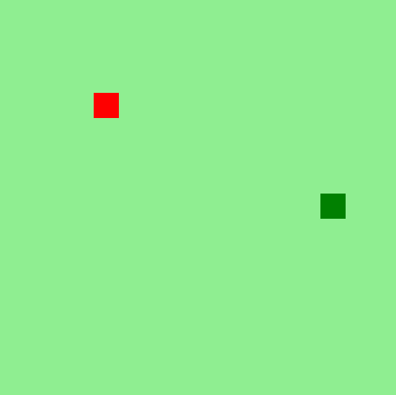

</div>

<br><br>

---
<div>

# Netflix

## Sobre o projeto.
Site responsivo da Netflix. Tema Bruxos e Magos. Site responsivo e com biblioteca do jQuery. Utilizei o carrossel do jQuery para colocar os filmes de forma semelhante a do site original.<br><br>
Data de conclusão: 29/10/2021<br><br>
## Ferramentas e tecnologias usadas nesse projeto.
 
```js    
function Netflix(Project) {
    if (Front End) {
        const Stack = `${HTML}, ${CSS}, ${JavaScript}`;
    } else (Framework) {
        const Stack = `${jQuery}`;
    }
};

``` 
<br>

<div align="center">


</div>

<br><br>

---
<div>

# Business

## Sobre o projeto.
Site responsivo desenvolvido para se adequar a telas abaixo de 450 pixels. Com menu e campo de cadastro. campo menu com degradê leve em tom de preto de cima para baixo.<br><br>
Data de conclusão: 28/10/2021<br><br>
## Ferramentas e tecnologias usadas nesse projeto.
```js    
function Business(Project) {
    const FrontEnd = `${HTML}, ${CSS}, ${JavaScript}`;
};

``` 
<br>

<div align="center">


</div>

<br><br>

---
<div>

# Lista de Tarefas

## Sobre o projeto.
Lista de tarefas com base em JavaScript. Projeto desenvolvido para mudar a cor ao clicar em concluido e mostrar uma mensagem de aviso ao deletar uma tarefa.<br><br>
Data de conclusão: 28/10/2021<br><br>
## Ferramentas e tecnologias usadas nesse projeto.
```js    
function ListaDeTarefas(Project) {
    const FrontEnd = `${HTML}, ${CSS}, ${JavaScript}`;
};

``` 
<br>

<div align="center">

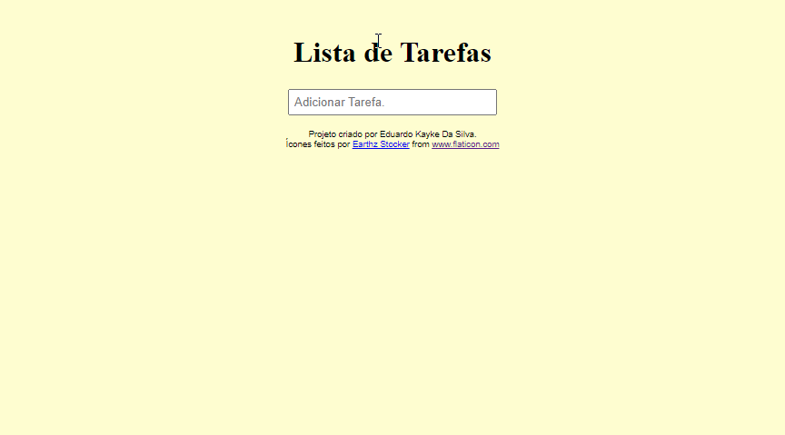

</div>

<br><br>

---
<div>

# Calculadora de Tabuada

## Sobre o projeto.
Tabuada desenvolvida com JavaScript, CSS e HTML. Mostrando números de 0 a 10 pelo valor escolhido de calculo. Dando assim o resultado de multiplicações. <br><br>
Data de conclusão: 27/10/2021<br><br>
## Ferramentas e tecnologias usadas nesse projeto.
```js    
function Tabuada(Project) {
    const FrontEnd = `${HTML}, ${CSS}, ${JavaScript}`;
};

``` 
<br>

<div align="center">

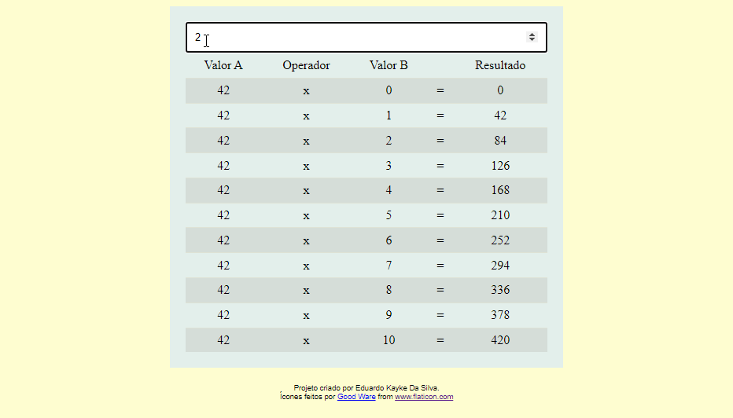

</div>

<br><br>

---
<div>

# Tela de Login La Vie Douce

## Sobre o projeto.
Tela de login de uma confeitaria fictícia, La Vie Douce. Inputs com hover deixam rosada a área ao passar o mouse e clicar no botão enviar. Tornei o input obrigatório para envio e com dicas para o usuário.  <br><br>
Data de conclusão: 27/10/2021<br><br>
## Ferramentas e tecnologias usadas nesse projeto.
```js    
function LaVieDouce(Project) {
    const FrontEnd = `${HTML}, ${CSS}, ${JavaScript}`;
};

``` 
<br>

<div align="center">

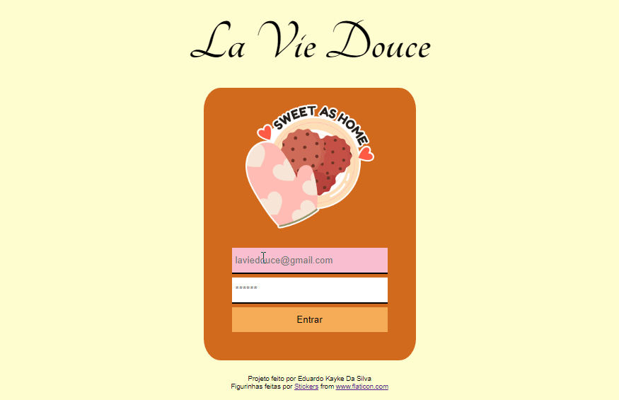

</div>

<br><br>

---
<div>

# Botões Animados e Alaranjados

## Sobre o projeto.
Botões desenvolvidos utilizando Keyframe Animation do CSS. Botões que mudam a cor ao encostar o mouse ou passar com o tab por cima.  <br><br>
Data de conclusão: 19/10/2021<br><br>
## Ferramentas e tecnologias usadas nesse projeto.
```js    
function Button(Project) {
    const FrontEnd = `${HTML}, ${CSS}`;
};

``` 
<br>

<div align="center">

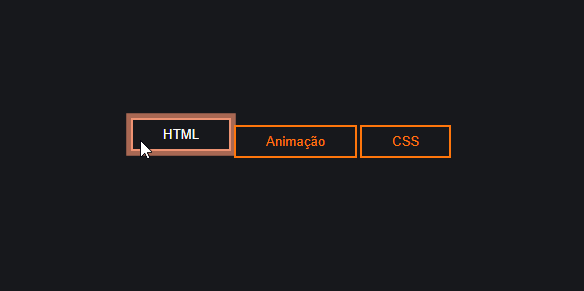

</div>

<br><br>

---
<div>

# Instagram Login

## Sobre o projeto.
Desenvolvimento da página de login do Instagram. Junto do login trago o meu perfil e com botões cinzas. Imagens ilustrativas em sua maior parte do projeto. <br><br>
Data de conclusão: 09/10/2021<br>
## Ferramentas e tecnologias usadas nesse projeto.
```js    
function InstagramLogin(Project) {
    const FrontEnd = `${HTML}, ${CSS}`;
};

``` 
<br>

<div align="center">

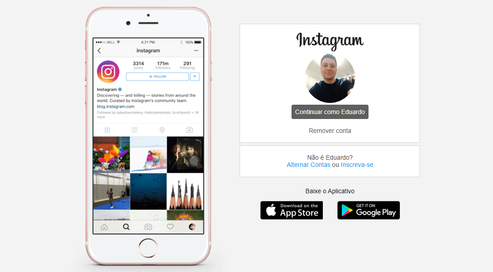

</div>

<br><br>
---
<div>

# Digital Full Stack

## Sobre o projeto.
Site estático desenvolvido no Visual Studio Code utilizando HTML e CSS. Apenas a primeira página um site para venda de cursos de uma escola de tecnologia, dei o nome de Digital Full Stack. Desenvolvimento em Full Stack na parte de Front end com as tecnologias de HTML, CSS, JavaScript e Node.js. O principal slogan da escola é:<br><br> Seja um desenvolvedor completo, aprenda HTML, CSS, JavaScript e Node.js. Estude conosco e melhore o seu futuro. A melhor escola de tecnologia do Brasil.<br><br>
Data de conclusão: 09/10/2021<br>
## Ferramentas e tecnologias usadas nesse projeto.
```js    
function DigitalFullStack(Project) {
    const FrontEnd = `${HTML}, ${CSS}`;
};

``` 
<br>

<div align="center">


</div>

<br><br>

---

> - Autores: 
>   - [Eduardo Kayke](https://github.com/EduardoKayke "Perfil do Eduardo")

- [Voltar ao perfil do Github.](https://github.com/EduardoKayke "Perfil do Eduardo") 
- [Meu email.](eduardokaykedasilva@gmail.com "Mande uma mensagem.")

_Um dia seremos a tecnologia. Biohacking a própria evolução de nós mesmos._
