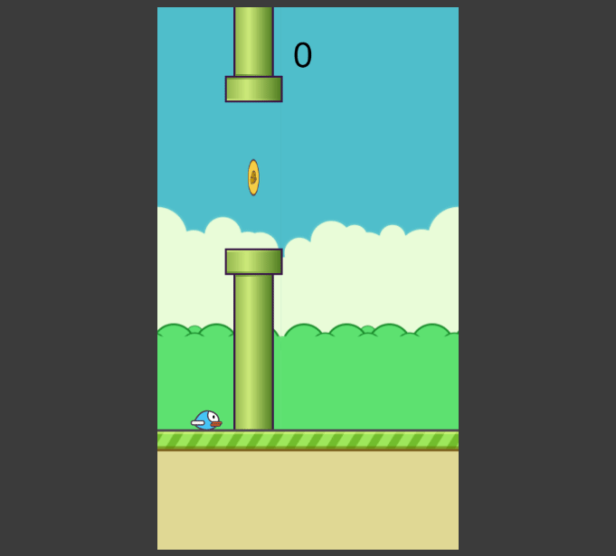
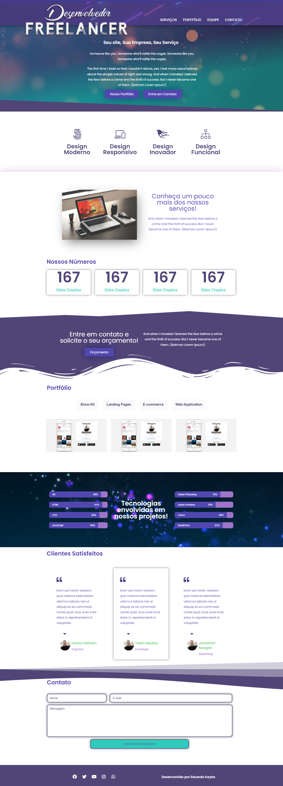
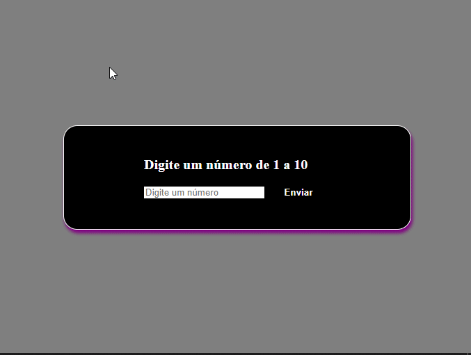

# Projetos de Cursos
Projetos dos Cursos. Desenvolvido durante as aulas!


## Lista dos queridinhos!

### Sites

[Instagram Clone](https://github.com/EduardoKayke/Instagram_Clone) - Habilidades usadas - HTML e CSS

[Digital Full Stack](https://github.com/EduardoKayke/Digital_Full_Stack) - Habilidades usadas - HTML e CSS


### Jogos

[Space Ship](https://github.com/EduardoKayke/Space_Ship_Game) - Habilidades usadas - HTML, CSS e JavaScript

[Flappy Bird](https://github.com/EduardoKayke/Flappy_Bird_Game) - Habilidades usadas - HTML, CSS e JavaScript

# Space Ship

## Sobre o projeto.
Esse é um projeto de um jogo muito famoso. Um clone de Space Ship.
<br><br>
Data de conclusão: 2/02/2022<br><br>
## Ferramentas e tecnologias usadas nesse projeto.
 
```js
function SpaceShip(Project) {
    if (Front End) {
        const Stack = `${HTML}, ${CSS}, ${JavaScript}`;
    }
};
```
<br>

<div align="center">


</div>

<br><br>

---

</div>

# Flappy Bird

## Sobre o projeto.
Esse é um projeto de um jogo muito famoso. Um clone de Flappy Bird. 
<br><br>
Data de conclusão: 01/02/2022<br><br>
## Ferramentas e tecnologias usadas nesse projeto.
 
```js
function FlappyBird(Project) {
    if (Front End) {
        const Stack = `${HTML}, ${CSS}, ${JavaScript}`;
    }
};
```
<br>

<div align="center">



</div>

<br><br>

---

</div>

# Desenvolvedor Freelancer

## Sobre o projeto.
Esse projeto foi construído na minha hospedagem. Por tempo limitado.
<br><br>
Data de conclusão: 28/01/2022<br><br>
## Ferramentas e tecnologias usadas nesse projeto.
 
```js
function DesenvolvedorFreelancer(Project) {
    if (Front End) {
        const Stack = `${WordPress}`;
    }
};
```
<br>

<div align="center">



</div>

<br><br>

---

<div>

# PRESG

## Sobre o projeto.
Esse projeto foi construído na minha hospedagem. Por tempo limitado. Quando eu desenvolvi, meu objetivo era criar o site da nossa agência de desenvolvedores.
<br><br>
Data de conclusão: 19/01/2022<br><br>
## Ferramentas e tecnologias usadas nesse projeto.
 
```js
function PRESG(Project) {
    if (Front End) {
        const Stack = `${WordPress}`;
    }
};
```
<br>

<div align="center">


</div>

<br><br>

---

<div>

# Bee Honey

## Sobre o projeto.
Bee Honey, pequeno projeto de jogo. Desenvolvido principalmente para o aprendizado de contrução de objetos e funções. Criado completamente apenas com JavaScript e imagens que usei como recursos gráficos.
<br><br>
Data de conclusão: 13/01/2022<br><br>
## Ferramentas e tecnologias usadas nesse projeto.
 
```js
function BeeHoney(Project) {
    if (Front End) {
        const Stack = `${HTML}, ${CSS}, ${JavaScript}`;
    }
};
```
<br>

<div align="center">


</div>

<br><br>

---

<div>

# Número Aleatório

## Sobre o projeto.
Site desenvolvido para devolver um número aleatório. 
Você digita um valor entre 1 e 10 e ele soma com um número aleatório.
Caso seja um valor diferente ele retorna uma mensagem de erro.<br><br>
Data de conclusão: 21/12/2021<br><br>
## Ferramentas e tecnologias usadas nesse projeto.
 
```js
function NumeroAleatorio(Project) {
    if (Front End) {
        const Stack = `${HTML}, ${CSS}, ${JavaScript}`;
    }
};
```
<br>

<div align="center">



</div>

<br><br>

---

<div>

# Agência

## Sobre o projeto.
Site simples de uma agência, podendo ser moldada para qualquer projeto. <br><br>
Data de conclusão: 10/12/2021<br><br>
## Ferramentas e tecnologias usadas nesse projeto.
 
```js
function ExactTime(Project) {
    if (Front End) {
        const Stack = `${HTML}, ${CSS}`;
    } else (Framework) {
        const Stack = `${Bootstrap}`;
    }
};
```
<br>

<div align="center">


</div>

<br><br>

---

<div>

# Exact Time E-Commerce

## Sobre o projeto.
E-commerce de uma relojoaria com imagens e catálogos. Site responsivo. Uma loja completa com endereço, valores dos produtos, promoções e vitrine virtual.<br><br>
Data de conclusão: 10/12/2021<br><br>
## Ferramentas e tecnologias usadas nesse projeto.
 
```js
function ExactTime(Project) {
    if (Front End) {
        const Stack = `${HTML}, ${CSS}`;
    } else (Framework) {
        const Stack = `${Bootstrap}`;
    }
};
```
<br>

<div align="center">


</div>

<br><br>

---

<div>

# Avangers

## Sobre o projeto.
Este projeto tem como principal objetivo desenvolver o trabalho em equipe. E também servir de portfólio. A conclusão final é uma landing page, modelo escolhido por Eduardo e com informações sobre os Avangers, tema escolhido por Samuel.<br><br>
Data de conclusão: 10/12/2021<br><br>
## Ferramentas e tecnologias usadas nesse projeto.
 
```js
function Avangers(Project) {
    if (Front End) {
        const Stack = `${HTML}, ${CSS}`;
    }
};
```
<br>

<div align="center">


</div>

<br><br>

---

<div>

# Pong

## Sobre o projeto.
Pong é o primeiro videojogo lucrativo da história, dando origem a um novo setor da indústria. Foi de importância fundamental na história do videojogo. Foi criado por Nolan Bushnell e Ted Dabney na forma de um console ligado a um monitor, movido a moedas.<br><br>
Data de conclusão: 10/12/2021<br><br>
## Ferramentas e tecnologias usadas nesse projeto.
 
```js
function Pong(Project) {
    if (Front End) {
        const Stack = `${HTML}, ${CSS}`;
    } 
};
```
<br>

<div align="center">


</div>

<br><br>

---

<div>

# Tela de Login e Registro

## Sobre o projeto.
Apresenta duas telas uma cadastro e outra de login. Totalmente responsivo para dispositivos móveis e com campos de checkbox para termos de serviço e recebimento de e-mail marketing.<br><br>
Data de conclusão: 10/12/2021<br><br>
## Ferramentas e tecnologias usadas nesse projeto.
 
```js
function LoginRegister(Project) {
    if (Front End) {
        const Stack = `${HTML}, ${CSS}`;
    } else (Framework) {
        const Stack = `${Bootstrap}`;
    }
};
```
<br>

<div align="center">


</div>

<br><br>

---

<div>

# Art: Exposição de Artes Urbanas

## Sobre o projeto.
Site responsivo de projetos artísticos. Galeria de grafite. A cidade mais viva e com alegria.<br><br>
Data de conclusão: 30/11/2021<br><br>
## Ferramentas e tecnologias usadas nesse projeto.
 
```js
function ArtUrbana(Project) {
    if (Front End) {
        const Stack = `${HTML}, ${CSS}`;
    } else (Framework) {
        const Stack = `${Bootstrap}`;
    }
};

```
<br>

<div align="center">


</div>

<br><br>

---

<div>

# Botões Refletores

## Sobre o projeto.
Botões coloridos que passam suas cores por clique. Iluminando a página com a cor escolhida de cada botão.<br><br>
Data de conclusão: 25/11/2021<br><br>
## Ferramentas e tecnologias usadas nesse projeto.
 
```js    
function ReflectorButtons(Project) {
    const FrontEnd = `${HTML}, ${CSS}, ${JavaScript}`;
};

``` 
<br>

<div align="center">


</div>

<br><br>

---

<div>

# Lista de Tarefas

## Sobre o projeto.
Lista de tarefas criada para facilitar a rotina diária. Podendo adicionar e remover suas atividades ao longo do dia. Utilizei o Bootstrap para o estilo da página. As informações são salvas no banco de dados interno do navegador.<br><br>
Data de conclusão: 17/11/2021<br><br>
## Ferramentas e tecnologias usadas nesse projeto.
 
```js    
function ListaDeTarefas(Project) {
    if (Front End) {
        const Stack = `${HTML}, ${CSS}, ${JavaScript}`;
    } else (Framework) {
        const Stack = `${Bootstrap}`;
    }
};

```
<br>

<div align="center">


</div>

<br><br>

---

<div>

# Snake

## Sobre o projeto.
Lançado para os fliperamas, o jogo era monocromático e o personagem era movido pelas setas do teclado, porém sua única diferença era sua jogabilidade multiplayer. Seu objetivo também era o mesmo, cada personagem tinha que “comer” o que aparecia na tela e evitar choques contra os muros do cenário.<br><br>
Data de conclusão: 17/11/2021<br><br>
## Ferramentas e tecnologias usadas nesse projeto.
 
```js    
function Snake(Project) {
    const FrontEnd = `${HTML}, ${CSS}, ${JavaScript}`;
};

``` 
<br>

<div align="center">


</div>

<br><br>

---
<div>

# Netflix

## Sobre o projeto.
Site responsivo da Netflix. Tema Bruxos e Magos. Site responsivo e com biblioteca do jQuery. Utilizei o carrossel do jQuery para colocar os filmes de forma semelhante a do site original.<br><br>
Data de conclusão: 29/10/2021<br><br>
## Ferramentas e tecnologias usadas nesse projeto.
 
```js    
function Netflix(Project) {
    if (Front End) {
        const Stack = `${HTML}, ${CSS}, ${JavaScript}`;
    } else (Framework) {
        const Stack = `${jQuery}`;
    }
};

``` 
<br>

<div align="center">


</div>

<br><br>

---
<div>

# Business

## Sobre o projeto.
Site responsivo desenvolvido para se adequar a telas abaixo de 450 pixels. Com menu e campo de cadastro. campo menu com degradê leve em tom de preto de cima para baixo.<br><br>
Data de conclusão: 28/10/2021<br><br>
## Ferramentas e tecnologias usadas nesse projeto.
```js    
function Business(Project) {
    const FrontEnd = `${HTML}, ${CSS}, ${JavaScript}`;
};

``` 
<br>

<div align="center">


</div>

<br><br>

---
<div>

# Lista de Tarefas

## Sobre o projeto.
Lista de tarefas com base em JavaScript. Projeto desenvolvido para mudar a cor ao clicar em concluido e mostrar uma mensagem de aviso ao deletar uma tarefa.<br><br>
Data de conclusão: 28/10/2021<br><br>
## Ferramentas e tecnologias usadas nesse projeto.
```js    
function ListaDeTarefas(Project) {
    const FrontEnd = `${HTML}, ${CSS}, ${JavaScript}`;
};

``` 
<br>

<div align="center">


</div>

<br><br>

---
<div>

# Calculadora de Tabuada

## Sobre o projeto.
Tabuada desenvolvida com JavaScript, CSS e HTML. Mostrando números de 0 a 10 pelo valor escolhido de calculo. Dando assim o resultado de multiplicações. <br><br>
Data de conclusão: 27/10/2021<br><br>
## Ferramentas e tecnologias usadas nesse projeto.
```js    
function Tabuada(Project) {
    const FrontEnd = `${HTML}, ${CSS}, ${JavaScript}`;
};

``` 
<br>

<div align="center">


</div>

<br><br>

---
<div>

# Tela de Login La Vie Douce

## Sobre o projeto.
Tela de login de uma confeitaria fictícia, La Vie Douce. Inputs com hover deixam rosada a área ao passar o mouse e clicar no botão enviar. Tornei o input obrigatório para envio e com dicas para o usuário.  <br><br>
Data de conclusão: 27/10/2021<br><br>
## Ferramentas e tecnologias usadas nesse projeto.
```js    
function LaVieDouce(Project) {
    const FrontEnd = `${HTML}, ${CSS}, ${JavaScript}`;
};

``` 
<br>

<div align="center">


</div>

<br><br>

---
<div>

# Botões Animados e Alaranjados

## Sobre o projeto.
Botões desenvolvidos utilizando Keyframe Animation do CSS. Botões que mudam a cor ao encostar o mouse ou passar com o tab por cima.  <br><br>
Data de conclusão: 19/10/2021<br><br>
## Ferramentas e tecnologias usadas nesse projeto.
```js    
function Button(Project) {
    const FrontEnd = `${HTML}, ${CSS}`;
};

``` 
<br>

<div align="center">


</div>

<br><br>

---

> - Autores: 
>   - [Eduardo Kayke](https://github.com/EduardoKayke "Perfil do Eduardo")

- [Voltar ao perfil do Github.](https://github.com/EduardoKayke "Perfil do Eduardo") 
- [Meu email.](eduardokaykedasilva@gmail.com "Mande uma mensagem.")

_Um dia seremos a tecnologia. Biohacking a própria evolução de nós mesmos._
