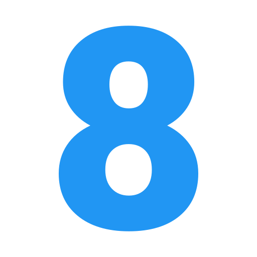
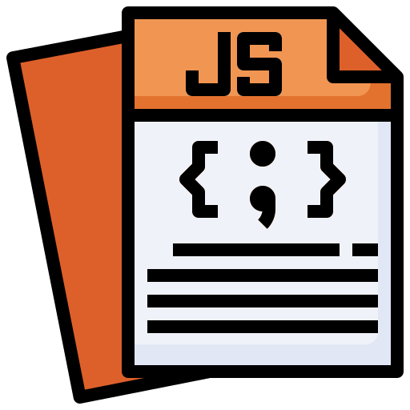

<div align="center">

# Portfólio <br><br>
 
 <a href="https://web.telegram.org/z/#-1582796052" target='_blank'></a> <a href="https://linkedin.com/in/eduardokaykedasilva" target="blank"></a> <a href="https://web.telegram.org/z/#-1582796052" target="blank"></a> <a href="https://web.telegram.org/z/#-1582796052" target='_blank'></a><br><br>


</div>
Olá, eu sou o Eduardo. Sou Desenvolvedor Full Stack Jr. Esse repositório serve como armazenamento e portfólio para os meus projetos nas mais diversas linguagens e ferramentas. Os projetos estão em ordem de criação, do mais novo para o mais velho. Para que eu consiga comparar meus antigos projetos e ver minha própria evolução.
<br><br>

<div align="center">

<h1> Projetos Até o Momento </h1>

</div>

<div align="center">




</div>

---
<div>

# Pong.

## Sobre o projeto.
Jogo desenvolvido no Visual Studio Code utilizando HTML, CSS e JavaScript. O game é muito famoso por ser o primeiro jogo desenvolvido pela Atari. <br><br>
Data de conclusão: 00/00/0000<br><br>
## Ferramentas e tecnologias usadas nesse projeto.

<div align="center">
<a href="https://web.telegram.org/z/#-1582796052" target='_blank'></a> <a href="https://web.telegram.org/z/#-1582796052" target='_blank'></a> <a href="https://web.telegram.org/z/#-1582796052" target='_blank'></a>

</div>

### Clone esse repositório.
```
    git clone https://github.com/EduardoKayke/Projetos.git
``` 
<br>

<div align="center">

AQUI VAI UM GIF DO PROJETO

</div>

<br><br>
---
<div>

# Netflix.

## Sobre o projeto.
Site responsivo da Netflix. Tema Bruxos e Magos. Site responsivo e com biblioteca do jQuery. Utilizamos o carrossel do jQuery para colocar os filmes da Netflix.<br><br>
Data de conclusão: 29/10/2021<br><br>
## Ferramentas e tecnologias usadas nesse projeto.

<div align="center">

<a href="https://web.telegram.org/z/#-1582796052" target='_blank'></a> <a href="https://web.telegram.org/z/#-1582796052" target='_blank'></a> <a href="https://web.telegram.org/z/#-1582796052" target='_blank'></a> 

</div>

### Clone esse repositório.
```
    git clone https://github.com/EduardoKayke/Projetos.git
``` 
<br>

<div align="center">


</div>

<br><br>

---
<div>

# Business.

## Sobre o projeto.
Site responsivo desenvolvido para se adequar a telas abaixo de 450 pixels. Com menu e campo de cadastro. campo menu com degradê leve em tom de preto de cima para baixo.<br><br>
Data de conclusão: 28/10/2021<br><br>
## Ferramentas e tecnologias usadas nesse projeto.

<div align="center">
<a href="https://web.telegram.org/z/#-1582796052" target='_blank'></a> <a href="https://web.telegram.org/z/#-1582796052" target='_blank'></a> <a href="https://web.telegram.org/z/#-1582796052" target='_blank'></a>

</div>

### Clone esse repositório.
```
    git clone https://github.com/EduardoKayke/Projetos.git
``` 
<br>

<div align="center">


</div>

<br><br>

---
<div>

# Lista de Tarefas.

## Sobre o projeto.
Lista de tarefas com base em JavaScript. Projeto desenvolvido para mudar a cor ao clicar em concluido e mostrar uma mensagem de aviso ao deletar uma tarefa.<br><br>
Data de conclusão: 28/10/2021<br><br>
## Ferramentas e tecnologias usadas nesse projeto.

<div align="center">
<a href="https://web.telegram.org/z/#-1582796052" target='_blank'></a> <a href="https://web.telegram.org/z/#-1582796052" target='_blank'></a> <a href="https://web.telegram.org/z/#-1582796052" target='_blank'></a>

</div>

### Clone esse repositório.
```
    git clone https://github.com/EduardoKayke/Projetos.git
``` 
<br>

<div align="center">


</div>

<br><br>

---
<div>

# Calculadora de Tabuada.

## Sobre o projeto.
Tabuada desenvolvida com JavaScript, CSS e HTML. Mostrando números de 0 a 10 pelo valor escolhido de calculo. Dando assim o resultado de multiplicações. <br><br>
Data de conclusão: 27/10/2021<br><br>
## Ferramentas e tecnologias usadas nesse projeto.

<div align="center">
<a href="https://web.telegram.org/z/#-1582796052" target='_blank'></a> <a href="https://web.telegram.org/z/#-1582796052" target='_blank'></a> <a href="https://web.telegram.org/z/#-1582796052" target='_blank'></a>

</div>

### Clone esse repositório.
```
    git clone https://github.com/EduardoKayke/Projetos.git
``` 
<br>

<div align="center">


</div>

<br><br>

---
<div>

# Tela de Login La Vie Douce.

## Sobre o projeto.
Tela de login de uma confeitaria fictícia, La Vie Douce. Inputs com hover deixam rosada a área ao passar o mouse e clicar no botão enviar. Tornei o input obrigatório para envio e com dicas para o usuário.  <br><br>
Data de conclusão: 27/10/2021<br><br>
## Ferramentas e tecnologias usadas nesse projeto.

<div align="center">
<a href="https://web.telegram.org/z/#-1582796052" target='_blank'></a> <a href="https://web.telegram.org/z/#-1582796052" target='_blank'></a> <a href="https://web.telegram.org/z/#-1582796052" target='_blank'></a> 

</div>

### Clone esse repositório.
```
    git clone https://github.com/EduardoKayke/Projetos.git
``` 
<br>

<div align="center">


</div>

<br><br>

---
<div>

# Botões Animados e Alaranjados.

## Sobre o projeto.
Botões desenvolvidos utilizando Keyframe Animation do CSS. Botões que mudam a cor ao encostar o mouse ou passar com o tab por cima.  <br><br>
Data de conclusão: 19/10/2021<br><br>
## Ferramentas e tecnologias usadas nesse projeto.

<div align="center">
<a href="https://web.telegram.org/z/#-1582796052" target='_blank'></a> <a href="https://web.telegram.org/z/#-1582796052" target='_blank'></a>

</div>

### Clone esse repositório.
```
    git clone https://github.com/EduardoKayke/Projetos.git
``` 
<br>

<div align="center">


</div>

<br><br>

---
<div>

# Instagram Login.

## Sobre o projeto.
Desenvolvimento da página de login do Instagram. Junto do login trago o meu perfil e com botões cinzas. Imagens ilustrativas em sua maior parte do projeto. <br><br>
Data de conclusão: 09/10/2021<br>
## Ferramentas e tecnologias usadas nesse projeto.

<div align="center">
<a href="https://web.telegram.org/z/#-1582796052" target='_blank'></a> <a href="https://web.telegram.org/z/#-1582796052" target='_blank'></a>

</div>

### Clone esse repositório.
```
    git clone https://github.com/EduardoKayke/Projetos.git
``` 
<br>

<div align="center">


</div>

<br><br>
---
<div>

# Digital Full Stack.

## Sobre o projeto.
Site estático desenvolvido no Visual Studio Code utilizando HTML e CSS. Apenas a primeira página um site para venda de cursos de uma escola de tecnologia, dei o nome de Digital Full Stack. Desenvolvimento em Full Stack na parte de Front end com as tecnologias de HTML, CSS, JavaScript e Node.js. O principal slogan da escola é:<br><br> Seja um desenvolvedor completo, aprenda HTML, CSS, JavaScript e Node.js. Estude conosco e melhore o seu futuro. A melhor escola de tecnologia do Brasil.<br><br>
Data de conclusão: 09/10/2021<br>
## Ferramentas e tecnologias usadas nesse projeto.

<div align="center">
<a href="https://web.telegram.org/z/#-1582796052" target='_blank'></a> <a href="https://web.telegram.org/z/#-1582796052" target='_blank'></a>

</div>

### Clone esse repositório.
```
    git clone https://github.com/EduardoKayke/Projetos.git
``` 
<br>

<div align="center">


</div>

<br><br>

---

> - Autores: 
>   - [Eduardo Kayke](https://github.com/EduardoKayke "Perfil do Eduardo")

- [Voltar ao perfil do Github.](https://github.com/EduardoKayke "Perfil do Eduardo") 
- [Meu email.](eduardokaykedasilva@gmail.com "Mande uma mensagem.")

_Um dia seremos a tecnologia. Biohacking a própria evolução de nós mesmos._
